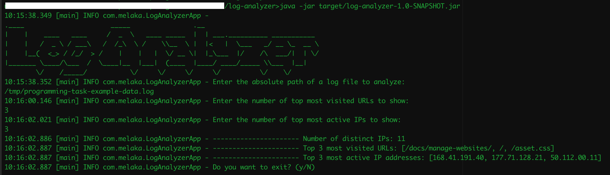
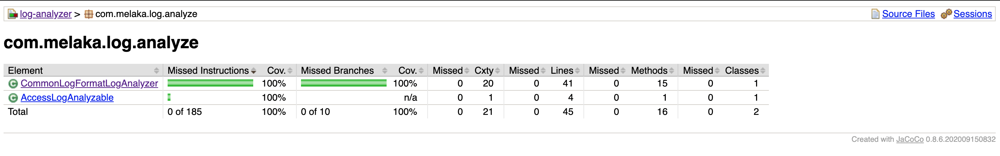

# log-analyzer  
This project reads and analyzes a given log file in [Common Log Format](https://en.wikipedia.org/wiki/Common_Log_Format).
As the result of the analysis it outputs following information. 

1. Number of unique IPs
2. Top n most visited URLs
3. Top m most active IPs

Where n, m can be provided as inputs to the application.  

## How to run the project 
- First to build the maven project please execute ```mvn clean install```. This generates a jar file under the target folder.
- To run the jar, execute ```java -jar target/log-analyzer-1.0-SNAPSHOT.jar```
- After the above step a console application will start. Please follow the on-screen instructions.  
- Please note that Java 11 is required to run this application.

Following is a screenshot from a sample run of the application.



## Results for the provided log file
1. Number of unique IPs: 11
2. Top 3 most visited URLs: [/docs/manage-websites/, /, /asset.css]
3. Top 3 most active IPs: [168.41.191.40, 177.71.128.21, 50.112.00.11]

* Please note that a copy of this provided log file can be found under the test resources of the project with name ```valid-data.log```

## Code coverage
A code coverage report is generated under target/jacoco-report/index.html using [JaCoCo](https://www.jacoco.org/jacoco/trunk/index.html) when this project is built.
Following is a screenshot of the report.




## How extra log files were generated
Python tool [log-generator](https://pypi.org/project/log-generator/) was used to generate extra test data.
