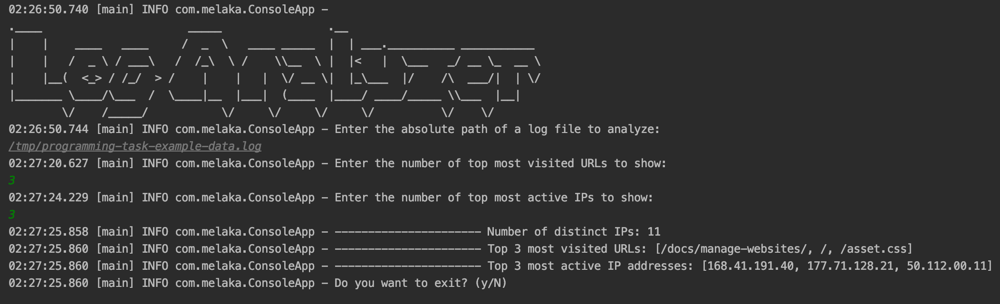

# log-analyzer    
This project reads and analyze a given log file in [Common Log Format](https://en.wikipedia.org/wiki/Common_Log_Format).
As the result of the analysis it return following data. 

1. Number of unique IPs
2. Top n most visited URLs
3. Top m most active IPs

Where n, m can be provided as inputs to the application.  

## How to run the project 
- Run the main method at ConsoleApp class
- Follow the on screen instructions
- Please note that Java 11 is required to run this application

Following is a screenshot from a sample run of the application

## Results for the provided log file
1. Number of unique IPs: 11
2. Top 3 Most visited URLs: [/docs/manage-websites/, /, /asset.css]
3. Top 3 most active IPs: [168.41.191.40, 177.71.128.21, 50.112.00.11]

## How extra log files were generated
Python tool [log-generator](https://pypi.org/project/log-generator/) was used to generate extra test data
